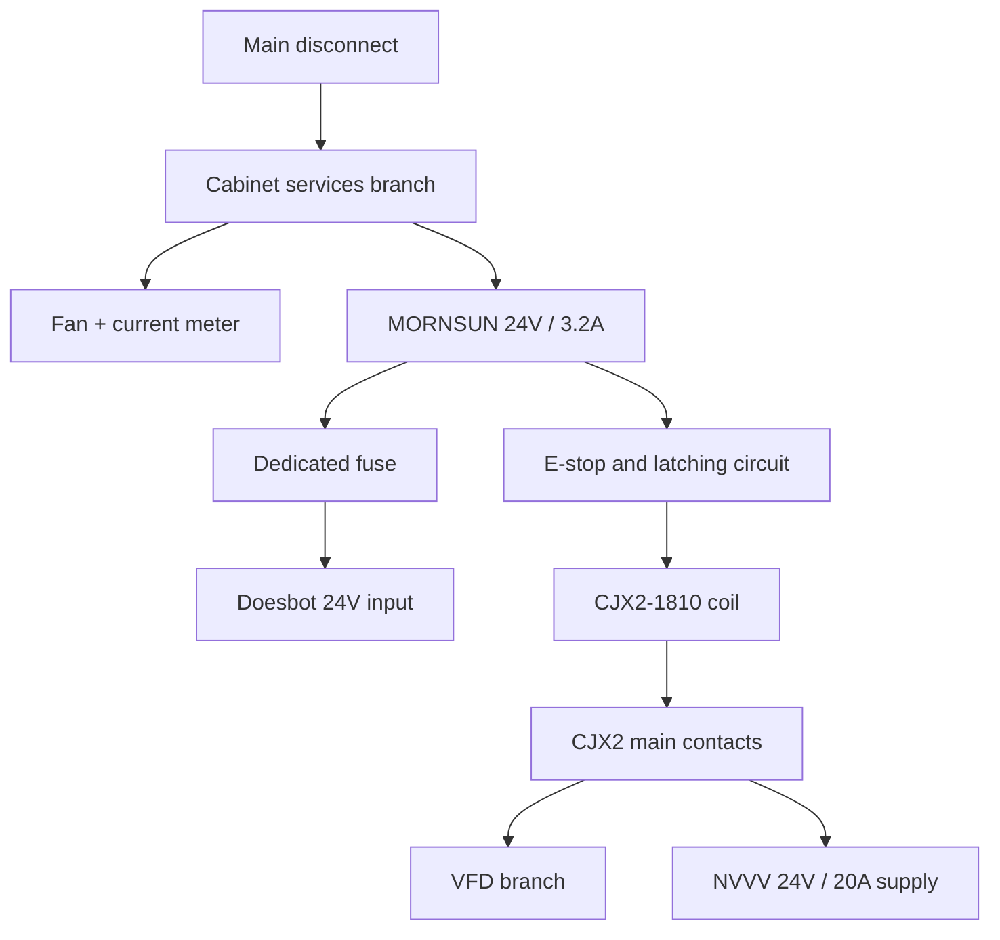

```mermaid
flowchart TD
    A["Main disconnect"] --> B["Cabinet services branch"]
    B --> C["Fan + current meter"]
    B --> D["MORNSUN 24V / 3.2A"]
    D --> E["E-stop and latching circuit"]
    D --> F["Dedicated fuse"]
    F --> G["Doesbot 24V input"]

    E --> H["CJX2-1810 coil"]
    H --> I["CJX2 main contacts"]
    I --> J["VFD branch"]
    I --> K["NVVV 24V / 20A supply"]
```